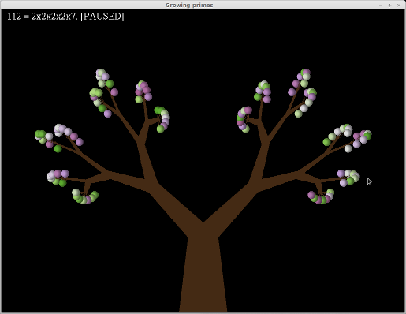

A little experiment in visualization of the integer prime factorization, drawing numbers as "plants".

Every prime factor contributes to a junction in the "plant", the branches have "fruits" at the tips.

The total amount of fruits is thus equal to the number itself.

The big clusters (representing big primes) are layed out using [Fermats Spiral](http://en.wikipedia.org/wiki/Fermat's_spiral).

Hacked together in C++, uses OpenGL/GLUT, tested on Linux and Windows.

